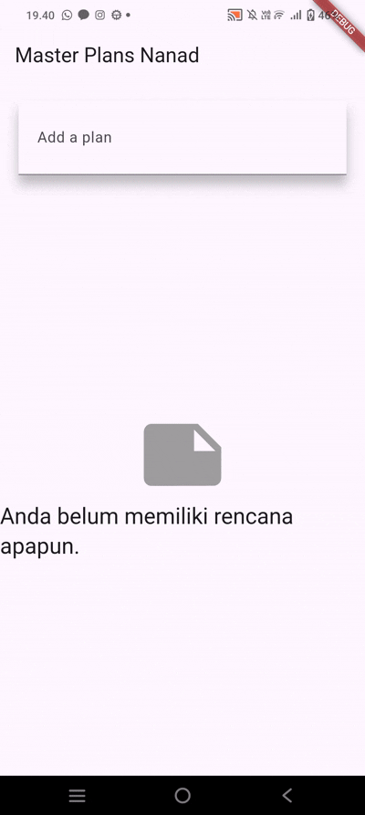

1. Selesaikan langkah-langkah praktikum tersebut, lalu dokumentasikan berupa GIF hasil akhir praktikum beserta penjelasannya di file README.md! Jika Anda menemukan ada yang error atau tidak berjalan dengan baik, silakan diperbaiki.

()

2. Jelaskan maksud dari langkah 4 pada praktikum tersebut! Mengapa dilakukan demikian?
Langkah ini membuat "Barrel File" (data_layer.dart) untuk menyatukan (mengekspor) model Plan dan Task. Ini bertujuan untuk membuat proses impor di file lain menjadi lebih ringkas dan bersih (import '../models/data_layer.dart';).

3. Mengapa perlu variabel plan di langkah 6 pada praktikum tersebut? Mengapa dibuat konstanta ?
Kegunaan: Variabel plan berfungsi sebagai penyimpanan state utama aplikasi, memuat seluruh data tugas (List).
Konstanta (const): Class Plan dan Task bersifat immutable (tidak dapat diubah). Setiap pembaruan (tambah/edit/centang) memerlukan pembuatan objek Plan yang baru (dengan setState()), bukan memodifikasi objek lama.

4. Lakukan capture hasil dari Langkah 9 berupa GIF, kemudian jelaskan apa yang telah Anda buat!

()


5. Apa kegunaan method pada Langkah 11 dan 13 dalam lifecyle state ?
Pada langkah 11 initState() berfungsi untuk bertanggung jawab untuk menginisialisasi sumber daya yang diperlukan, seperti ScrollController, dan mengatur listener untuk menyembunyikan keyboard saat scrolling. Dipanggil hanya sekali saat State pertama kali dibuat.

Sedangkan, dilangkah 13 berfungsi untuk membersihkan (dispose()) sumber daya yang telah dibuat (misalnya ScrollController). Mencegah kebocoran memori dengan memastikan sumber daya tidak terpakai setelah widget dihancurkan. Dipanggil sebelum State dihancurkan.

6. Kumpulkan laporan praktikum Anda berupa link commit atau repository GitHub ke dosen yang telah disepakati !

---

## Praktikum 2: InheritedWidget untuk Manajemen State

### 1. Jelaskan mana yang dimaksud InheritedWidget pada langkah 1 tersebut! Mengapa yang digunakan InheritedNotifier?

**InheritedWidget** yang dimaksud adalah `PlanProvider` yang extends `InheritedNotifier<ValueNotifier<Plan>>`.

**Alasan menggunakan InheritedNotifier:**
- `InheritedNotifier` adalah spesialisasi dari `InheritedWidget` yang secara otomatis merebuild widget-widget yang bergantung padanya ketika notifier berubah
- Dengan `InheritedNotifier`, kita tidak perlu override method `updateShouldNotify()` karena sudah otomatis mendengarkan perubahan dari `ValueNotifier`
- Lebih efisien untuk state management yang menggunakan `ValueNotifier` atau `ChangeNotifier`
- Widget child akan otomatis rebuild hanya ketika `ValueNotifier<Plan>` berubah nilai, bukan setiap kali parent rebuild

### 2. Jelaskan maksud dari method di langkah 3 pada praktikum tersebut! Mengapa dilakukan demikian?

Method yang dimaksud adalah method `completedCount` dan `completenessMessage` di class Plan:

```dart
int get completedCount => tasks
  .where((task) => task.complete)
  .length;

String get completenessMessage =>
  '$completedCount out of ${tasks.length} tasks';
```

**Maksud dan Alasan:**
- **`completedCount`**: Menghitung jumlah task yang sudah selesai (complete = true) menggunakan method `.where()` untuk filter
- **`completenessMessage`**: Membuat string pesan progress yang mudah dibaca, menampilkan "X out of Y tasks"
- **Mengapa dilakukan demikian:**
  - Mengikuti prinsip **encapsulation** - logika perhitungan ada di dalam model Plan
  - **Reusable** - bisa dipanggil dari mana saja tanpa perlu menulis ulang logika perhitungan
  - **Reactive** - karena menggunakan getter, nilai akan selalu up-to-date setiap kali diakses
  - Memudahkan maintenance - jika format pesan perlu diubah, cukup edit di satu tempat

### 3. Lakukan capture hasil dari Langkah 9 berupa GIF, kemudian jelaskan apa yang telah Anda buat!


**Penjelasan Aplikasi:**

Saya telah membuat aplikasi Master Plan dengan fitur state management menggunakan `InheritedNotifier`:

**Fitur yang diimplementasikan:**
1. **State Management dengan PlanProvider** - Data plan disimpan dan dikelola melalui `ValueNotifier<Plan>` yang dibungkus dalam `InheritedNotifier`
2. **Add Task** - Tombol FloatingActionButton untuk menambah task baru ke dalam list
3. **Checkbox** - Menandai task sebagai complete/incomplete
4. **Edit Task** - TextFormField untuk mengedit deskripsi setiap task
5. **Progress Counter** - Menampilkan jumlah task yang selesai di bagian bawah layar (footer) dalam format "X out of Y tasks"
6. **Reactive UI** - UI otomatis update saat ada perubahan data tanpa perlu `setState()` manual, karena menggunakan `ValueListenableBuilder`

**Keunggulan implementasi:**
- Separation of concerns: Model, Provider, dan View terpisah dengan baik
- Immutable data: Setiap perubahan membuat objek Plan baru
- Efficient rebuilds: Hanya widget yang bergantung pada data yang rebuild
- Clean code: Tidak ada setState() scattered di berbagai tempat

---

## Praktikum 3: Membuat State di Multiple Screens

### 1. Berdasarkan Praktikum 3 yang telah Anda lakukan, jelaskan maksud dari gambar diagram berikut ini!

**Penjelasan Diagram:**

Diagram tersebut menunjukkan **navigasi dan hierarki widget** dalam aplikasi Master Plan dengan dua screen:

**Bagian Kiri (PlanCreatorScreen - Biru):**
- `MaterialApp` → Root aplikasi
- `PlanProvider` → Menyediakan state management untuk List<Plan>
- `PlanCreatorScreen` → Screen utama untuk membuat dan melihat daftar plans
  - `Column` → Layout vertikal
    - `TextField` → Input untuk menambah plan baru
    - `Expanded` → Widget yang mengambil sisa ruang
      - `ListView` → Menampilkan daftar semua plans

**Bagian Kanan (PlanScreen - Hijau):**
- Setelah `Navigator.push` dari PlanCreatorScreen
- `PlanScreen` → Screen detail untuk satu plan tertentu
  - `Scaffold` → Struktur dasar screen
    - `Column` → Layout vertikal
      - `Expanded` → Widget yang mengambil sisa ruang
        - `ListView` → Menampilkan daftar tasks dalam plan
      - `SafeArea` → Area aman di bagian bawah
        - `Text` → Menampilkan completeness message (progress counter)

**Alur Navigasi:**
1. User membuat plan di `PlanCreatorScreen` 
2. User tap pada plan di ListView
3. `Navigator.push` membawa user ke `PlanScreen` dengan data plan tertentu
4. `PlanScreen` menampilkan detail tasks dari plan tersebut
5. Kedua screen tetap terhubung dengan `PlanProvider` yang sama untuk berbagi state

**Key Points:**
- State disimpan di level `PlanProvider` (di atas `MaterialApp`)
- Kedua screen bisa mengakses dan memodifikasi data yang sama
- Navigasi dilakukan dengan `Navigator.push`
- Data tetap sinkron karena menggunakan shared state melalui `InheritedNotifier`

### 2. Lakukan capture hasil dari Langkah 14 berupa GIF, kemudian jelaskan apa yang telah Anda buat!



**Penjelasan Aplikasi:**

Saya telah membuat aplikasi Master Plan yang lengkap dengan **multiple screens** dan **shared state management**:

**Screen 1 - PlanCreatorScreen:**
1. **TextField untuk membuat plan** - User bisa mengetik nama plan baru dan tekan enter
2. **ListView Plans** - Menampilkan semua plans yang sudah dibuat dengan:
   - Title: Nama plan
   - Subtitle: Progress message (contoh: "3 out of 10 tasks")
3. **Empty State** - Jika belum ada plan, menampilkan icon dan pesan "Anda belum memiliki rencana apapun."
4. **Tap Navigation** - Tap pada plan akan membuka PlanScreen detail

**Screen 2 - PlanScreen:**
1. **AppBar dengan nama plan** - Menampilkan nama plan sebagai title
2. **FloatingActionButton (+)** - Menambah task baru ke dalam plan
3. **ListView Tasks** - Menampilkan daftar tasks dengan:
   - Checkbox untuk mark complete/incomplete
   - TextFormField untuk edit deskripsi task
4. **Progress Footer** - SafeArea di bawah menampilkan "X out of Y tasks"

**Fitur State Management:**
- ✅ **Shared State** - `PlanProvider` menyimpan `List<Plan>` yang bisa diakses dari semua screen
- ✅ **Real-time Updates** - Perubahan di PlanScreen langsung terlihat di PlanCreatorScreen saat kembali
- ✅ **Multiple Plans** - User bisa membuat banyak plans dengan tasks yang berbeda-beda
- ✅ **Persistent Navigation** - Data tidak hilang saat berpindah screen
- ✅ **Reactive UI** - Menggunakan `ValueListenableBuilder` untuk auto-rebuild

**Teknologi yang Digunakan:**
- State Management: `InheritedNotifier<ValueNotifier<List<Plan>>>`
- Navigation: `Navigator.push` dengan `MaterialPageRoute`
- UI Updates: `ValueListenableBuilder` untuk reactive programming
- Data Model: Immutable `Plan` dan `Task` classes

